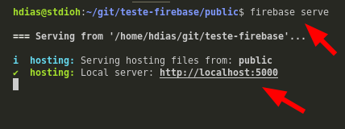

# teste-firebase
Testing Firebase

# Requirements
* [Node/NPM](https://nodejs.org/en/download/)
* [firebase-cli](https://firebase.google.com/docs/cli)
* [firebase-tools](https://www.npmjs.com/package/firebase-tools)
* [Yarn](https://classic.yarnpkg.com/lang/en/docs/install/#debian-stable)


# DEMO
## https://test-f7577.web.app/

# Setup
```sh
git clone https://github.com/stdioh321/teste-firebase.git
cd teste-firebase
yarn --cwd public --modules-folder libs install
```

# Run

```sh
firebase serve
```
It will try to start the server at:

## **http://localhost:5000**

Terminal|Index|
---|---
|


# References
# === [Tutorial Fireship 01](https://www.youtube.com/watch?v=9kRgVxULbag) ===
# === [Tutorial Fireship 02](https://www.youtube.com/watch?v=q5J5ho7YUhA) ===


* [Firebase](https://firebase.google.com/?hl=pt)